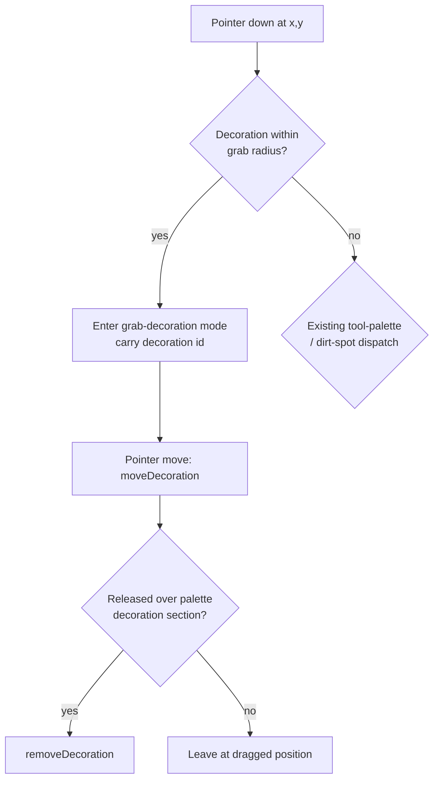

# Aquarium Tank Decorations - Plan

## Goal Capsule

- **Objective:** A preschooler can decorate their aquarium tank with unlockable items they place anywhere and rearrange freely, giving the sandbox tool an ongoing source of novelty beyond the feed/clean/play loop.
- **Means:** Extend the existing tool-palette + tap/drag interaction pattern (`pages/aquarium/index.jsx`, `lib/aquarium/simulation.js`) with a new, non-consumed decoration item type, unlocked through the same care actions that already fill the egg meter.
- **Product authority:** This brainstorm, confirmed in dialogue with the app's owner.
- **Open blockers:** None — ready for planning.

## Product Contract

### Summary

Adds a decoration system to the aquarium: a growing palette of placeable items (plants, castle, treasure, etc.) that a preschooler drags anywhere in the tank and can pick up and move at any time. New items unlock gradually through the same feed/play/clean actions that already advance the egg-progress meter.

### Problem Frame

The aquarium's current loop — feed, play, wipe a dirt spot — was built for a toddler's cause-and-effect learning and is reported as too simple and boring now. Once a fish's needs are met there is nothing left to discover: care produces an occasional new egg, but the tank itself never changes, and nothing rewards continued engagement beyond that one milestone.

### Key Decisions

- **Freeform placement, not snap-to-zone.** Reuses the existing tap/drag interaction the child already knows and preserves full sandbox-arrangement freedom; the resulting overlap/clutter risk is managed with a cap (R6) rather than layout constraints. Governs R1, R3, R6.
- **Unlocked via care, not open from the start.** New decoration items unlock progressively through the same feed/play/clean actions that fill the egg meter, so the existing care loop stays the source of the reward instead of adding an unrelated toy box. Governs R5, R7.
- **Decorations are purely visual — fish do not react to or avoid them.** Keeps this round's scope to placement rather than fish behavior/AI; living, fish-reactive decoration is a deferred idea (see Scope Boundaries).

### Requirements

- R1. A decoration palette (or an expandable section of the existing tool palette) offers unlocked items the child can select, then place by tapping/dragging into the tank — the same gesture already used for food/toy drops.
- R2. A placed decoration persists at its exact drop point across sessions, saved like the rest of the tank state, until moved or removed.
- R3. A placed decoration can be picked up and moved to a new position at any time, or removed entirely, using the same drag-based interaction already used elsewhere in the tank.
- R4. Decorations do not consume or disappear on their own — no timeout, no interaction-triggered consumption (unlike food/toy drops).
- R5. New decoration items unlock over time via the same care actions (feeding, playing, wiping dirt spots) that fill the egg-progress meter, tracked as an independent progress meter from the egg's.
- R6. Placed decorations are capped per decoration type (not by one shared total), mirroring the existing per-type drop and dirt-spot caps, so a full tank cannot obscure the fish and unlocking one type doesn't block placing another.
- R7. Decoration-unlock pacing reads as distinguishable from egg-hatch pacing — the two should not consistently land on the same action so they don't read as one reward.

### Acceptance Examples

- AE1. **Covers R1, R2.** Given the decoration palette has at least one unlocked item, when the child selects it and taps/drags into the tank, then a decoration appears at that point and is still there after closing and reopening the app.
- AE2. **Covers R3.** Given a decoration is already placed, when the child drags it to a new point, then it moves there and the old spot is vacated; when the child drags it onto the palette's decoration section instead (KTD4), then it disappears from the tank and becomes placeable again from the palette.
- AE3. **Covers R5, R7.** Given ongoing care actions accumulate, when the decoration-unlock meter separately reaches its threshold, then a new item appears in the palette — this should not always coincide with an egg spawning from the same actions.
- AE4. **Covers R6.** Given a decoration type is at its per-type cap, when the child tries to place another of that type, then placement is refused and no new decoration is added (KTD3).

### Scope Boundaries

**Deferred for later:**
- Decorations that fish interact with — hide behind, nibble, swim around (the "living decoration" approach explored and set aside this round).
- Themed backdrops or whole-scene presets, as opposed to individually placeable items.

**Outside this product's identity:**
- Currency, shop, or points tied to decorations — the app has no numbers or economy anywhere; decorations stay reward-only, never purchased.
- Snap-to-grid/zone placement — considered and rejected in favor of freeform (see Key Decisions).

### Dependencies / Assumptions

- Assumes fish continue to ignore obstacles (per the existing movement design) — decorations add no collision or avoidance behavior.

### Sources

- `pages/aquarium/index.jsx`, `lib/aquarium/simulation.js`, `lib/aquarium/movement.js`, `lib/aquarium/storage.js`, `lib/aquarium/creatures.js`, `lib/aquarium/sound.js` — existing aquarium module, read directly and via research.
- `.claude/rules/aquarium.md` — module conventions, including the `document.elementFromPoint` jsdom gap this plan routes around (KTD2).
- One planning-time question — "should fish react to decorations if purely-visual doesn't move engagement" — stays in Scope Boundaries as a deferred future idea, not a blocker; it is about a materially different, larger feature.
- One implementation-time tuning value remains open: the exact decoration-unlock threshold relative to the egg meter's (KTD8) — deferred to implementation/playtesting, not a planning blocker.

---

## Planning Contract

**Product Contract preservation:** Unchanged by this planning pass. R1–R7 and their wording (including the R6 and AE2 corrections from document review) carry forward as-is.

### Key Technical Decisions

- KTD1. **Decorations get a new, persistent entity list, not the food/toy drop shape.** (session-settled: user-approved — chosen over reusing `foodDrops`/`toyDrops`: decorations persist indefinitely and are individually movable, which the ephemeral consumed-on-contact drop shape does not model.) Governs U1, U3.
- KTD2. **Grab-vs-place uses a position-based pointer-down hit-test, not `document.elementFromPoint`.** (session-settled: user-approved — chosen over reusing the existing dirt-spot `elementFromPoint` pattern: a distance-based check is a pure function, avoids the jsdom `elementFromPoint` gap noted in `.claude/rules/aquarium.md`, and matches the codebase's existing pure-function style.) Governs U3, U4.
- KTD3. **Cap-reached refuses placement; it does not evict the oldest decoration.** (session-settled: user-approved — chosen over mirroring `addDrop`'s slice-oldest-out eviction: a placed decoration is a player-intentional, persistent object, and silently deleting one a child chose to place would break the app's no-punishment, no-surprise-loss design.) Governs R6.
- KTD4. **Removal is drag-back-onto-the-palette.** (session-settled: user-approved — chosen over a dedicated trash-drop target: reuses existing UI, and gives the child a legible "opposite of placing" gesture.) Governs U4.
- KTD5. **The per-type cap does not add spacing/overlap prevention.** (session-settled: user-approved — chosen over building collision/spacing logic to guarantee decorations can never stack on the fish: this app has no obstacle/collision concept anywhere today, and adding one is materially larger than what was brainstormed. Accepted as a known limitation — see Risks.) Governs R6.
- KTD6. The decoration section of the tool palette stays hidden while no types are unlocked yet, revealing as items unlock — mirrors the egg only appearing once spawned, rather than inventing locked-slot iconography. Governs U5.
- KTD7. A decoration unlock fires the existing `pulse` + `spawnEffect` + sound-cue triple (a new `'unlock'` entry in `TONES`) on the newly revealed palette icon, mirroring `wipeSpot`'s sparkle sequence. Governs U5.
- KTD8. The decoration-unlock meter fills on the same care actions as the egg meter but crosses its threshold at a different action count, so the two do not consistently unlock together (R7). The exact threshold is an implementation-time tuning constant, set during U3 and confirmed by playtesting rather than fixed here. Governs R7, U3.
- KTD9. A returning player's care history from before this feature existed does not count toward their first decoration unlock — the meter starts at zero for every tank, matching how the egg mechanic itself was introduced without retroactive credit. Governs U3.
- KTD10. New decoration fields default onto an old-shaped save at load time rather than bumping `SCHEMA_VERSION` — `storage.js` currently discards a save wholesale on any version mismatch, and this feature does not need that reset. Governs U2.

### High-Level Technical Design

Pointer-down on the tank now has three possible dispatches instead of two; the new decoration-grab check runs first and everything else is unchanged:



### Assumptions

- The v1 decoration item set (five point-placeable types) is content, not architecture — the exact names/emoji chosen in U1 can change without touching U2–U5.
- Playtesting may adjust KTD8's numeric threshold; the desync mechanism itself (independent, non-common-multiple threshold) is the planning-time commitment.

### Risks & Dependencies

- **Cap doesn't guarantee no-overlap (KTD5).** Accepted for this plan; revisit only if it proves confusing in practice, at which point spacing/collision logic would be a separate, larger follow-up.
- **Unlock-pacing desync (KTD8) needs playtesting**, not just a passing test, to confirm it reads as two distinct rewards to an actual preschooler.
- No external dependencies — all work is within the existing `lib/aquarium/` and `pages/aquarium/` module.

---

## Implementation Units

### U1. Decoration type catalog

- **Goal:** Define the v1 catalog of point-placeable decoration types as a data-driven layer, mirroring `creatures.js`'s species-as-data pattern so the item set can grow without touching game logic.
- **Requirements:** R1, R5
- **Dependencies:** none
- **Files:**
  - `lib/aquarium/decorations.js` (new)
  - `lib/aquarium/decorations.test.js` (new)
- **Approach:**
  1. Export a `DECORATION_TYPES` object keyed by id, mirroring `SPECIES` in `creatures.js`: `{ key, name, emoji }`.
  2. Define five v1 types in a fixed unlock order (e.g. seaweed, coral, treasure chest, castle, bubble rock) — exact names/emoji are content (see Assumptions), not a plan-time decision.
  3. Export `decorationKeys()` and `getDecorationType(key)` helpers mirroring `speciesKeys()`/`getSpecies()`, including a default fallback for an unknown key.
- **Patterns to follow:** `lib/aquarium/creatures.js` (`SPECIES`, `DEFAULT_SPECIES`, `speciesKeys()`, `getSpecies()`).
- **Test scenarios:**
  - Happy path: `getDecorationType(key)` returns the right entry for every defined key.
  - Edge case: `getDecorationType` on an unknown key falls back to a defined default rather than returning `undefined`.
  - Happy path: `decorationKeys()` returns all keys in the intended unlock order.
- **Verification:** All v1 catalog entries have `name`/`emoji` populated; unit tests above pass.

### U2. Additive-safe save schema for decoration fields

- **Goal:** Let new decoration data be added to the persisted tank without wholesale-discarding existing users' saves (KTD10).
- **Requirements:** R2
- **Dependencies:** none
- **Files:**
  - `lib/aquarium/storage.js`
  - `lib/aquarium/storage.test.js`
- **Approach:**
  1. Keep `SCHEMA_VERSION` at its current value — do not bump it for this feature.
  2. In the load path, default missing decoration fields (`decorations: []`, `decorationProgress: 0`, `unlockedDecorationTypes: []`) onto an old-shaped-but-same-version parsed save, the same way a fresh default tank sets them.
- **Patterns to follow:** `loadTank`'s existing version-check branch; `createDefaultTank`'s field defaults.
- **Test scenarios:**
  - Happy path: loading a pre-decorations save (missing the new keys) yields a tank with the new fields defaulted and every pre-existing field untouched.
  - Happy path: loading a save that already has decoration fields round-trips them unchanged.
  - Edge case: a corrupt/missing save still falls back to `createDefaultTank`'s output, unaffected by this change.
- **Verification:** Existing storage tests stay green; new test confirms an old-shaped save loads without data loss and without a version bump.

### U3. Decoration state and simulation logic

- **Goal:** Add pure state-transition functions for placing, moving, removing, and unlocking decorations, plus per-type cap enforcement and the unlock-progress meter.
- **Requirements:** R1, R2, R3, R4, R5, R6, R7
- **Dependencies:** U1, U2
- **Files:**
  - `lib/aquarium/simulation.js`
  - `lib/aquarium/simulation.test.js`
- **Approach:**
  1. Extend the default tank shape with `decorations: []`, `decorationProgress: 0`, `unlockedDecorationTypes: []`.
  2. Add `placeDecoration(state, typeKey, x, y)`: refuses (no-op) if that type's placed count is at the per-type cap (KTD3); otherwise appends a new decoration entry.
  3. Add `moveDecoration(state, id, x, y)`: updates the matching decoration's position; no-op for an unknown id.
  4. Add `removeDecoration(state, id)`: removes the matching decoration; no-op for an unknown id.
  5. Extend the existing care-advancing path (alongside `withEggProgress`) to also advance `decorationProgress`; on crossing its threshold, append the next catalog entry (per U1's unlock order) to `unlockedDecorationTypes` and reset progress, using a threshold that desyncs from the egg meter's (KTD8).
  6. `unlockedDecorationTypes` starts empty for every tank, including pre-existing saves (KTD9).
- **Technical design:** `addDrop`'s cap-and-slice-oldest pattern is the wrong model for step 2 (KTD3) — follow `withEggProgress`'s guard-and-no-op pattern instead.
- **Patterns to follow:** `wipeDirtSpot`'s no-op-on-unknown-id convention; the repo-wide "does not mutate the input state" test convention.
- **Test scenarios:**
  - Happy path: placing a decoration under the cap adds it at the given position.
  - Edge case: placing a decoration at the per-type cap is a no-op — `decorations` unchanged.
  - Happy path: moving an existing decoration updates its position and nothing else.
  - Edge case: moving or removing an unknown id is a no-op, state unchanged.
  - Happy path: removing a decoration frees its type's cap slot so a new one can be placed.
  - Happy path: care actions advance `decorationProgress`; crossing its threshold unlocks the next catalog type and resets progress.
  - Integration: repeated identical care actions cross the egg threshold and the decoration threshold at different action counts (asserts KTD8's desync, not simultaneous crossing).
  - Mutation-safety: none of the above functions mutate the input state.
- **Verification:** New simulation tests pass; existing egg-progress, drop-cap, and dirt-spot tests remain green and unaffected.

### U4. Grab-vs-place pointer dispatch

- **Goal:** Let the pointer-down handler distinguish "grab an existing decoration to move it" from today's "start painting a new item," and drive the resulting drag/drop/removal interaction.
- **Requirements:** R3
- **Dependencies:** U3
- **Files:**
  - `pages/aquarium/index.jsx`
  - `__tests__/pages/aquarium/index.test.jsx`
- **Approach:**
  1. In `handleTankPointerDown`, before setting today's drag state, hit-test the pointer-down point against `tank.decorations` using a distance check (mirrors `distance()` in `simulation.js`) within a small grab radius (sibling constant to `CONTACT_RADIUS`/`DETECTION_RADIUS`); the nearest decoration within radius wins on overlap.
  2. On a hit, enter a grab mode carrying the decoration id instead of today's paint mode; `handleTankPointerMove` repositions that one decoration (`moveDecoration`) instead of sampling paint-drops along the path.
  3. On pointer-up: if released over the palette's decoration section, call `removeDecoration` (KTD4); otherwise the decoration stays at its last dragged position, already committed via `moveDecoration`.
  4. When no decoration is hit, fall through unchanged to the existing dirt-spot/paint-drop dispatch.
- **Technical design:**
  ```
  pointerDown(x, y):
    if nearest_decoration_within(x, y, GRAB_RADIUS) exists:
      mode = grab-decoration; carry its id
    else:
      mode = existing paint / dirt-spot dispatch (unchanged)
  ```
- **Patterns to follow:** `rectFraction` for coordinate conversion; `MIN_DRAG_PX`/`DRAG_SAMPLE_MS` throttling; the `commit(updater, cue)` helper.
- **Test scenarios:**
  - Happy path: pointer-down on an empty area with the decoration tool selected still places a new decoration (unchanged behavior).
  - Happy path: pointer-down within grab radius of a placed decoration, then pointer-move, repositions that decoration without creating a new one.
  - Edge case: two decorations overlap at the pointer-down point; the nearer one grabs.
  - Happy path: dragging a grabbed decoration onto the palette's decoration section and releasing removes it.
  - Edge case: a tap (below `MIN_DRAG_PX`) on a placed decoration does not move or remove it.
- **Verification:** New `pointerDown`→`pointerMove`→`pointerUp` sequence tests pass; existing single-`click` interaction tests remain unaffected.

### U5. Decoration rendering, palette, and unlock feedback

- **Goal:** Render placed decorations and the decoration palette section, and give unlocking a perceptible, distinguishable cue.
- **Requirements:** R1, R7
- **Dependencies:** U3, U4
- **Files:**
  - `pages/aquarium/index.jsx`
  - `pages/aquarium/index.module.css`
  - `lib/aquarium/sound.js`
- **Approach:**
  1. Render each entry in `tank.decorations` as an absolutely-positioned `<button>` (interactive/grabbable, matching `.dirtSpot`'s pattern rather than `.foodDrop`'s `pointer-events: none` one), centered via `translate(-50%, -50%)`, `left`/`top` as `%` from the same 0..1 space.
  2. Add a decoration section to the tool palette that stays hidden while `unlockedDecorationTypes` is empty and reveals as items unlock (KTD6).
  3. Add a `'unlock'` entry to `TONES` in `sound.js`; on an unlock-threshold crossing (from U3), fire the existing `pulse` + `spawnEffect` + `commit(..., 'unlock')` triple on the newly revealed palette icon (KTD7).
- **Patterns to follow:** `.dirtSpot`/`.foodDrop` CSS rules in `index.module.css`; `TONES` entries in `sound.js`; the `pulse`/`spawnEffect` helpers already in `index.jsx`.
- **Test scenarios:**
  - Happy path: a placed decoration renders at its `x`/`y` position.
  - Happy path: the decoration palette section is absent when no types are unlocked, and shows the unlocked types otherwise.
  - Integration: crossing the decoration-unlock threshold triggers the pulse/effect/sound sequence on the palette.
- **Verification:** New rendering tests pass; the palette shows/hides correctly across the empty-to-unlocked transition.

---

## Verification Contract

| Command | Applies to | Gate |
|---|---|---|
| `npm test` | All units | `lib/aquarium/*.test.js` and `__tests__/pages/aquarium/index.test.jsx` pass, new and existing |
| `npm run lint` | All units | No new errors under the existing eslint-airbnb config |

---

## Definition of Done

- All five units land; `npm test` and `npm run lint` pass clean.
- A manual smoke pass in the dev server confirms existing aquarium behavior (feeding, playing, wiping dirt spots, egg hatching) is unaffected.
- Every feature-bearing unit's test scenarios pass.
- No dead-end code remains from exploring KTD1's entity-shape decision, if an alternative was tried during implementation.
